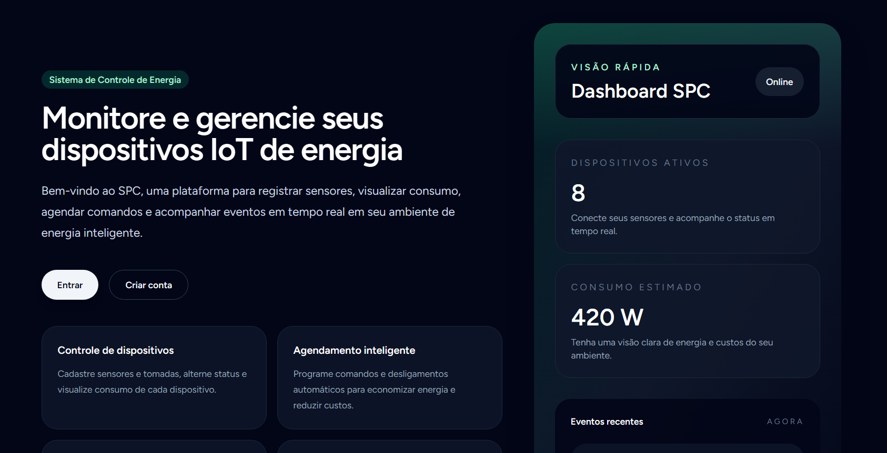

# Smart Power Controller - Sistema Web e IoT

O **Smart Power Controller** é um ecossistema projetado para o monitoramento, análise de métricas e gerenciamento remoto de consumo energético de eletrodomésticos via hardware IoT para a disciplina de Engenharia de Software do professor Heleno Cardoso.

## Materiais
- [DOCUMENTO DE REQUISITOS](https://github.com/JoaoVictorCarvalho-DEV/trabalho_arquitetura_de_software/blob/main/requisitos/DOCUMENTO%20DE%20REQUISITOS.docx)
- [DIAGRAMAS](https://github.com/JoaoVictorCarvalho-DEV/trabalho_arquitetura_de_software/tree/main/diagramas)
- [BANCO DE DADOS](https://github.com/JoaoVictorCarvalho-DEV/trabalho_arquitetura_de_software/tree/main/banco_de_dados)
- [DOCUMENTAÇÃO](https://github.com/JoaoVictorCarvalho-DEV/trabalho_arquitetura_de_software/blob/main/Documenta%C3%A7%C3%A3o%20Smart%20Power%20Controller.docx)

## Engenharia
- **Padrão Arquitetural:** MVC (Model-View-Controller) isolando regras de negócio da API, interface cliente e firmware.
- **API PADRÃO REST**

## Tecnologias para implementação
- **BACKEND** PHP + Laravel
- **FRONTEND** VueJS
- **DATABASE** POSTGRESS

## Sistema web
- **SPC** https://spc-production-0b6c.up.railway.app

## Hospedagem
- **Railway** https://railway.com/

## Design de Interface e Protótipo no Figma
https://www.figma.com/make/zWf6iIngYgXNrhtHau8E1g/Smart-Power-Controller?t=cAHUzON6IuXkBzmQ-1

## Fontes
https://github.com/CloudEducationBrazil/WydenEngenhariaDeSoftware

## Equipe e Desenvolvimento
JOÃO VÍCTOR MIRANDA
LUIZ FERNANDO BARBOSA
MARIA EDUARDA OLIVEIRA
